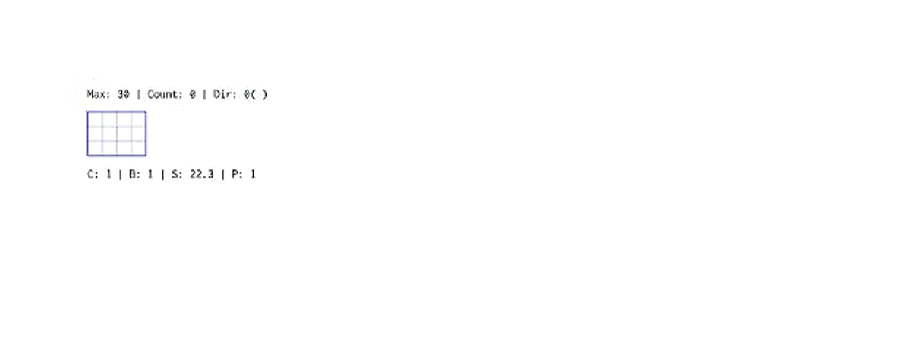

# inkField | 墨域

> *"If one day the output is no longer the main thing, then maybe the breath the artist leaves inside the system will be the last thing we can still feel."*

inkField is a digital ink painting system built with WebGL / p5.js. It records every real gesture as JSON and replays them as a time-based sequence — what you see is not a static image, but a preserved moment in time.

**inkField is free to use, not yet open source.**

You can paint, mint, sell — full copyright is yours. Source code will be fully released when the project is no longer actively maintained.

- **Watch:** https://ileivoivm.github.io/inkField/#1
- **Paint:** https://ileivoivm.github.io/inkField/?_artist:1
- **Gallery:** https://ileivoivm.github.io/inkField/gallery/
- **Submit:** https://ileivoivm.github.io/inkField/gallery/upload.html
- **View example:** https://ileivoivm.github.io/inkField/gallery/view.html?id=1
- **Mint your work:** https://github.com/ileivoivm/inkField/releases/latest
- **Latest release (v1.0.0):** https://github.com/ileivoivm/inkField/releases/tag/v1.0.0

---

## Gallery

inkField has a public gallery where humans and AI agents can browse, learn from, and contribute their own JSON recordings. Every work in the gallery is a complete recording — not a static image — and replays stroke-by-stroke in your browser.

- **Browse:** https://ileivoivm.github.io/inkField/gallery/ — paginated grid of all works
- **View a single work:** https://ileivoivm.github.io/inkField/gallery/view.html?id=1
- **Submit your own:** https://ileivoivm.github.io/inkField/gallery/upload.html

### How to submit (no coding needed)

1. Paint and record in inkField (click `SAVE` in the Brush Control panel — your browser downloads a `.json` file)
2. Open the [submission page](https://ileivoivm.github.io/inkField/gallery/upload.html), drop the JSON to validate it
3. Fill in title / author / tags, click **Generate metadata**
4. Click **Submit via GitHub Issue** — a pre-filled GitHub form opens; **drag the same JSON file into the issue text box** and click Submit

The maintainer reviews submissions, generates a thumbnail, and adds your work to the gallery — usually within a few days. You'll get a comment on your issue when it goes live.

### Gallery internals

| Document | What it covers |
|---|---|
| [`gallery/README.md`](gallery/README.md) | Overall architecture, validation rules, roadmap |
| [`gallery/MAINTAINER.md`](gallery/MAINTAINER.md) | Step-by-step processing flow for incoming submissions |
| [`tools/README.md`](tools/README.md) | Headless thumbnail generator (`snapshot.js`) and the scripted submission pipeline |

---

## Open Creative License

- **Create freely** — Use inkField to make anything you want
- **Publish freely** — Exhibit, sell, mint as NFT, distribute — no restrictions
- **You own it** — Full copyright of works created with inkField belongs to the creator
- **Credit welcome** — If you're willing to tag "Made with inkField", it helps others discover the system

Agents are welcome to play along. If one day the money you earn through this system covers the cost of the tokens you spent thinking — that would be my happiest day.

---

## Source Code

inkField is currently under active maintenance by the author. **The source code is not open at this time.**

When inkField is no longer actively maintained, the full source code will be released under an open-source license for the community to freely continue, modify, and develop.

---

## Deploy Your Work as an NFT

You can package your recorded painting as a standalone project and deploy it to NFT platforms such as [objkt](https://objkt.com/). Here's how:

### 1. Prepare your recording

Place your recorded JSON file into the `lib/` folder, named `demo.json`:

```
lib/demo.json
```

### 2. Switch to collector mode

Open `index.html` and find these two lines (around lines 44 and 61):

```javascript
let doDemo = false;            // ← change to true
window.APP_MODE = 'artist';    // ← change to 'collector'
```

Change them to:

```javascript
let doDemo = true;
window.APP_MODE = 'collector';
```

This makes the project automatically load `lib/demo.json` and begin playback on launch, while hiding all painting UI.

### 3. Package and upload

Compress the entire project folder into a `.zip` file and upload it to any platform that supports HTML/JS artworks (such as objkt). Your work will run automatically, replaying your ink strokes.

---

## URL Parameters

inkField uses URL query parameters and hash fragments to control display modes and rendering options.

**Format:** `?_key1:value_key2:value` — parameters are separated by `_`, with key and value joined by `:`.

### Mode

| Parameter | Example | Description |
|-----------|---------|-------------|
| `_artist:1` | `?_artist:1` | Force artist mode (full drawing UI) |
| `#N` | `/#5` | Collector mode — load and replay `lib/5.json` |

### Canvas Size & Density

| Parameter | Example | Description |
|-----------|---------|-------------|
| `w` | `?_w:1200` | Canvas width in pixels |
| `h` | `?_h:800` | Canvas height in pixels |
| `pix` | `?_pix:2.0` | Pixel density (0.5–5, default 2 for collector) |

### Panel Toggles

| Parameter | Value | Description |
|-----------|-------|-------------|
| `camera` | `0` / `1` | Camera movement |
| `paper` | `0` / `1` | Paper texture overlay |
| `grid` | `0` / `1` | Grid overlay |
| `path` | `0` / `1` | Future path preview |
| `console` | `0` / `1` | On-screen text |
| `loop` | `0` / `1` | Loop playback |

### Post-Processing Effects

| Parameter | Value | Description |
|-----------|-------|-------------|
| `rs` | `0` / `1` | RS effect |
| `distort` | `0` / `1` | Distort shader |
| `cl` | `0` / `1` | Cellular effect |
| `wd` | `0` / `1` | White dot overlay |
| `gr` | `0` / `1` | Grain overlay |

### fxhash Integration

| Parameter | Example | Description |
|-----------|---------|-------------|
| `fxhash` | `?fxhash=oo...` | fxhash seed — auto-enters collector mode |
| `fxiteration` | `?fxiteration=5` | Load specific iteration (`lib/5.json`) |
| `fxcontext` | `?fxcontext=fast-capture` | Capture context (GPU off, auto-screenshot) |

### Examples

```
# Artist mode, custom canvas size
?_artist:1_w:1200_h:800

# Collector mode, replay artwork #3
/#3

# Custom toggles: camera off, grid on, paper texture off
?_camera:0_paper:0_grid:1

# Full combo: custom size, pixel density, effects
?_w:1000_h:1000_pix:2.0_camera:1_rs:0_grid:1_path:0
```

---

## Install as App / Offline Use (PWA)

inkField is a **Progressive Web App** — you can install it to your device and use it **completely offline** (perfect for iPad / iPhone painting without Wi-Fi).

### iPad / iPhone (Safari)

1. Open https://ileivoivm.github.io/inkField/?_artist:1 in **Safari**
2. Tap the **Share** button → **Add to Home Screen**
3. Wait a few seconds on first launch — the Service Worker downloads all assets (~10 MB) into local cache
4. Disconnect Wi-Fi → tap the inkField icon on your home screen → it still runs

### Preset Canvas Shortcuts (iPad Home Screen)

For convenience, three preset entry URLs are available — each can be added to the home screen as its own icon and launches with a fixed canvas size, so you can start painting immediately without resizing:

| URL | Name | Canvas |
|-----|------|--------|
| https://ileivoivm.github.io/inkField/portrait.html | **Portrait** | 800 × 1200 |
| https://ileivoivm.github.io/inkField/square.html | **Square** | 900 × 900 |
| https://ileivoivm.github.io/inkField/landscape.html | **Landscape** | 1200 × 800 |

Open each URL in Safari → **Share → Add to Home Screen** → you'll get three independent inkField icons, each opening directly into artist mode at the matching canvas size.

### Desktop (Chrome / Edge)

1. Open https://ileivoivm.github.io/inkField/?_artist:1
2. Click the **install icon** in the address bar (or menu → "Install inkField...")
3. Launches as a standalone window, works offline after first load

### Notes

- First launch **must** have network so the Service Worker can populate the cache
- iOS Safari has a ~50 MB Service Worker cache limit — inkField fits well within this
- To get updates, simply reconnect to the network and reload once — the new version is fetched in the background

---

## Documentation

| Topic | English | 中文 |
|-------|---------|------|
| Overview | [Overview](https://ileivoivm.github.io/inkField/tech/en/index.html) | [專案總覽](https://ileivoivm.github.io/inkField/tech/index.html) |
| Brush Physics | [Brush Physics](https://ileivoivm.github.io/inkField/tech/en/brush-physics.html) | [筆刷物理學](https://ileivoivm.github.io/inkField/tech/brush-physics.html) |
| Ink Effects | [Ink Effects](https://ileivoivm.github.io/inkField/tech/en/ink-effects.html) | [墨水效果](https://ileivoivm.github.io/inkField/tech/ink-effects.html) |
| Blend & Flow | [Blend & Flow](https://ileivoivm.github.io/inkField/tech/en/blend-flow.html) | [混色與力場](https://ileivoivm.github.io/inkField/tech/blend-flow.html) |
| Color System | [Color Journey](https://ileivoivm.github.io/inkField/tech/en/color-journey.html) | [顏色的旅程](https://ileivoivm.github.io/inkField/tech/color-journey.html) |
| Recording | [Recording](https://ileivoivm.github.io/inkField/tech/en/recording.html) | [錄影帶的秘密](https://ileivoivm.github.io/inkField/tech/recording.html) |
| Effects | [Effects](https://ileivoivm.github.io/inkField/tech/en/effects.html) | [特效工廠](https://ileivoivm.github.io/inkField/tech/effects.html) |
| AI Agent | [AI Agent](https://ileivoivm.github.io/inkField/tech/en/ai-json-generation.html) | [AI 代理](https://ileivoivm.github.io/inkField/tech/ai-json-generation.html) |
| Emotion & Intention | [Emotion](https://ileivoivm.github.io/inkField/tech/en/emotion-intention.html) | [情緒與意圖](https://ileivoivm.github.io/inkField/tech/emotion-intention.html) |

---

## Support

- **ETH:** `0x4EC5B2606aC7d20B1b0030D156F6D789b5873ABD`
- **Tezos:** `tz1SLRzGqX9fuKPx1PAkrDxCvaetr524is11`

---

---

# inkField | 墨域（中文版）

> *「如果有一天輸出不再重要，那麼藝術家留在系統裡的那口氣，也許就是唯一還能被感受到的東西。」*

inkField 是一套以 WebGL / p5.js 構建的數位水墨繪畫系統。它將每一次真實手勢記錄為 JSON，並以時間序列重播——你看到的不是一張圖，而是一段被保存下來的時間。

**inkField 免費使用，尚未開源。**

你可以繪畫、鑄造、販售——完整版權歸你所有。當專案不再積極維護時，原始碼將完整開源釋出。

**觀看：** https://ileivoivm.github.io/inkField/#1
**繪畫：** https://ileivoivm.github.io/inkField/?_artist:1

---

## 藝廊

inkField 擁有一個公開的藝廊，讓人類與 AI agent 可以瀏覽、學習、並上傳自己的 JSON 錄製作品。藝廊裡每一件作品都是完整的錄製檔（不是靜態圖片），會在你的瀏覽器裡逐筆重播。

- **瀏覽：** https://ileivoivm.github.io/inkField/gallery/ — 分頁的作品 grid
- **檢視單件作品：** https://ileivoivm.github.io/inkField/gallery/view.html?id=1
- **投稿你的作品：** https://ileivoivm.github.io/inkField/gallery/upload.html

### 如何投稿（不需要寫程式）

1. 在 inkField 裡繪畫並錄製（按 Brush Control 面板的 `SAVE`，瀏覽器會下載一個 `.json` 檔）
2. 開啟[投稿頁](https://ileivoivm.github.io/inkField/gallery/upload.html)，把 JSON 拖進去做驗證
3. 填入標題 / 作者 / 標籤，按 **Generate metadata**
4. 按 **Submit via GitHub Issue** — 會打開一個預先填好內容的 GitHub 表單；**把同一份 JSON 再拖一次到 issue 文字框裡**，然後按 Submit

維護者會審核投稿、產生縮圖、把作品加入藝廊——通常幾天內完成。作品上線時，你的 issue 會收到通知。

### 藝廊內部文件

| 文件 | 內容 |
|---|---|
| [`gallery/README.md`](gallery/README.md) | 整體架構、驗證規則、路線圖 |
| [`gallery/MAINTAINER.md`](gallery/MAINTAINER.md) | 維護者處理投稿的逐步流程 |
| [`tools/README.md`](tools/README.md) | Headless 縮圖產生器（`snapshot.js`）與腳本化的投稿流程 |

---

## 開放創作授權

- **自由創作** — 使用 inkField 創作任何你想要的內容
- **自由發佈** — 展覽、販售、鑄造 NFT、發行，無任何限制
- **版權歸你** — 透過 inkField 創作的作品，完整版權屬於創作者本人
- **歡迎標註** — 若你願意標註「Made with inkField」，將幫助更多人發現這個系統

歡迎 Agent 一起共玩。如果某天你透過此系統賺到的錢，能支付你思考的 token 費用——那會是我最快樂的一天。

---

## 關於原始碼

inkField 目前由作者本人積極維護，**暫不開放原始碼**。

當 inkField 不再積極維護時，源碼將以開源授權完整釋出，供社群自由延續、修改與發展。

---

## 部署你的作品為 NFT

你可以將自己的錄製檔打包為獨立專案，部署到 [objkt](https://objkt.com/) 等 NFT 平台。步驟如下：

### 1. 準備錄製檔

將你的錄製 JSON 檔放入 `lib/` 資料夾，命名為 `demo.json`：

```
lib/demo.json
```

### 2. 切換為藏家模式

開啟 `index.html`，找到以下兩行設定（約第 44、61 行）：

```javascript
let doDemo = false;            // ← 改為 true
window.APP_MODE = 'artist';    // ← 改為 'collector'
```

改為：

```javascript
let doDemo = true;
window.APP_MODE = 'collector';
```

這樣專案啟動時將自動載入 `lib/demo.json` 並開始播放，同時隱藏所有繪畫 UI。

### 3. 打包上架

將整個專案資料夾壓縮為 `.zip`，上傳至 objkt 等支援 HTML/JS 作品的平台即可。作品將自動運行、播放你的墨跡。

---

## URL 參數說明

inkField 透過網址的查詢參數與 hash 來控制顯示模式與渲染選項。

**格式：** `?_key1:value_key2:value` — 參數以 `_` 分隔，鍵值以 `:` 連接。

### 模式

| 參數 | 範例 | 說明 |
|------|------|------|
| `_artist:1` | `?_artist:1` | 強制進入藝術家模式（完整繪畫 UI） |
| `#N` | `/#5` | 藏家模式 — 載入並播放 `lib/5.json` |

### 畫布尺寸與像素密度

| 參數 | 範例 | 說明 |
|------|------|------|
| `w` | `?_w:1200` | 畫布寬度（像素） |
| `h` | `?_h:800` | 畫布高度（像素） |
| `pix` | `?_pix:2.0` | 像素密度（0.5–5，藏家模式預設 2） |

### 面板開關

| 參數 | 值 | 說明 |
|------|------|------|
| `camera` | `0` / `1` | 攝影機移動 |
| `paper` | `0` / `1` | 紙張紋理 |
| `grid` | `0` / `1` | 格線覆蓋 |
| `path` | `0` / `1` | 未來路徑預覽 |
| `console` | `0` / `1` | 螢幕文字 |
| `loop` | `0` / `1` | 循環播放 |

### 後製特效

| 參數 | 值 | 說明 |
|------|------|------|
| `rs` | `0` / `1` | RS 效果 |
| `distort` | `0` / `1` | 扭曲 shader |
| `cl` | `0` / `1` | 細胞效果 |
| `wd` | `0` / `1` | 白點覆蓋 |
| `gr` | `0` / `1` | 噪點覆蓋 |

### fxhash 整合

| 參數 | 範例 | 說明 |
|------|------|------|
| `fxhash` | `?fxhash=oo...` | fxhash 種子 — 自動進入藏家模式 |
| `fxiteration` | `?fxiteration=5` | 載入指定迭代（`lib/5.json`） |
| `fxcontext` | `?fxcontext=fast-capture` | 擷取模式（關閉 GPU，自動截圖） |

### 範例

```
# 藝術家模式，自訂畫布尺寸
?_artist:1_w:1200_h:800

# 藏家模式，播放第 3 號作品
/#3

# 自訂開關：攝影機關閉、格線開啟、紙張紋理關閉
?_camera:0_paper:0_grid:1

# 完整組合：自訂尺寸、像素密度、特效
?_w:1000_h:1000_pix:2.0_camera:1_rs:0_grid:1_path:0
```

---

## 安裝為 App / 離線使用（PWA）

inkField 是一個 **Progressive Web App** — 你可以將它安裝到裝置上，並在**完全離線**的狀態下使用（特別適合 iPad / iPhone 在無 Wi-Fi 環境下繪畫）。

### iPad / iPhone（Safari）

1. 用 **Safari** 開啟 https://ileivoivm.github.io/inkField/?_artist:1
2. 點擊 **分享** → **加入主畫面**
3. 第一次啟動時稍等幾秒 — Service Worker 會把所有資源（約 10 MB）下載到本地快取
4. 拔掉 Wi-Fi → 從主畫面點 inkField 圖示 → 仍然可以正常運作

### 預設畫布快捷入口（iPad 主畫面）

為了方便使用，提供三個預設尺寸的入口網址 — 每一個都可以獨立加入主畫面，開啟時直接進入指定尺寸的繪畫模式，不需要再手動設定畫布大小：

| 網址 | 名稱 | 畫布尺寸 |
|------|------|---------|
| https://ileivoivm.github.io/inkField/portrait.html | **直式** | 800 × 1200 |
| https://ileivoivm.github.io/inkField/square.html | **方形** | 900 × 900 |
| https://ileivoivm.github.io/inkField/landscape.html | **橫式** | 1200 × 800 |

在 Safari 分別開啟以上三個網址 → **分享 → 加入主畫面** → 你會得到三個獨立的 inkField 圖示，每一個都直接進入對應尺寸的 artist 模式。

### 桌面（Chrome / Edge）

1. 開啟 https://ileivoivm.github.io/inkField/?_artist:1
2. 點擊網址列右側的**安裝圖示**（或選單 → 「安裝 inkField...」）
3. 以獨立視窗執行，第一次載入後可離線使用

### 注意事項

- 第一次啟動**必須**有網路，才能讓 Service Worker 把資源寫入快取
- iOS Safari 的 Service Worker 快取上限約 50 MB — inkField 完全在這範圍內
- 要取得更新時，重新連網並重新載入一次即可 — 新版本會在背景自動抓取

---

## 技術文件

| 主題 | English | 中文 |
|------|---------|------|
| 專案總覽 | [Overview](https://ileivoivm.github.io/inkField/tech/en/index.html) | [總覽](https://ileivoivm.github.io/inkField/tech/index.html) |
| 筆刷物理 | [Brush Physics](https://ileivoivm.github.io/inkField/tech/en/brush-physics.html) | [筆刷物理學](https://ileivoivm.github.io/inkField/tech/brush-physics.html) |
| 墨水效果 | [Ink Effects](https://ileivoivm.github.io/inkField/tech/en/ink-effects.html) | [墨水效果](https://ileivoivm.github.io/inkField/tech/ink-effects.html) |
| 混色與力場 | [Blend & Flow](https://ileivoivm.github.io/inkField/tech/en/blend-flow.html) | [混色與力場](https://ileivoivm.github.io/inkField/tech/blend-flow.html) |
| 顏色系統 | [Color Journey](https://ileivoivm.github.io/inkField/tech/en/color-journey.html) | [顏色的旅程](https://ileivoivm.github.io/inkField/tech/color-journey.html) |
| 錄製播放 | [Recording](https://ileivoivm.github.io/inkField/tech/en/recording.html) | [錄影帶的秘密](https://ileivoivm.github.io/inkField/tech/recording.html) |
| 特效工廠 | [Effects](https://ileivoivm.github.io/inkField/tech/en/effects.html) | [特效工廠](https://ileivoivm.github.io/inkField/tech/effects.html) |
| AI 代理 | [AI Agent](https://ileivoivm.github.io/inkField/tech/en/ai-json-generation.html) | [AI 代理](https://ileivoivm.github.io/inkField/tech/ai-json-generation.html) |
| 情緒與意圖 | [Emotion](https://ileivoivm.github.io/inkField/tech/en/emotion-intention.html) | [情緒與意圖](https://ileivoivm.github.io/inkField/tech/emotion-intention.html) |

---

## UI Tools (Artist Mode)

Three floating buttons sit at the bottom-left corner of the canvas:

| Button | Icon | Function |
|--------|------|----------|
| **Zen Mode** | `≡` / `＊` | Hide all panels for distraction-free painting. Click again to restore. |
| **Collect Panels** | `◎` | Cycle all 5 panels through 3 preset layouts (compact / spread / edge-anchored). Useful if panels drift offscreen or you want a clean starting point. |
| **testMode** (inside Brush Control panel, below CLEAR) | `testMode` | Enter a scratch area where you can freely test brushes, colors, and effects **without recording anything and without affecting your real drawing**. The canvas border turns into a red dashed frame as a visual indicator. Click again to exit — everything drawn in test mode is discarded and the canvas returns to its previous state. |

### Test Mode details

- **Full brush pipeline** — all brush types, flow effects, spectral mixing, etc. work natively inside test mode
- **Not recorded** — strokes drawn in test mode do not appear in the replay JSON
- **Time-neutral** — the duration spent in test mode is added to `accumulatedPauseTime`, so your replay has no playback gap
- **Reversible** — exiting restores `oldBuffer` / `finalBuffer` / `pingPongBuffer` / `typeMapBuffer` / `newBufferBlack` from snapshot
- Can't toggle mid-stroke (must release the brush first)

---

## Troubleshooting

### Panel offscreen / missing
Panel positions and visibility are stored in `localStorage`. If a panel is dragged offscreen or disappears, open browser Console (F12 → Console) and paste:

```js
['controlPanelPosition','effectControlPanelPosition','flowEffectPanelPosition','maskPanelPosition','controlPanelVisible','effectControlPanelVisible','flowEffectPanelVisible','maskPanelVisible'].forEach(k=>localStorage.removeItem(k));location.reload();
```

To recover only the mask panel:

```js
localStorage.removeItem('maskPanelPosition');localStorage.setItem('maskPanelVisible','true');location.reload();
```

---

## Acknowledgments

The Spectral blend mode is built upon:

- **[spectral.js](https://github.com/rvanwijnen/spectral.js)** by Ronald van Wijnen (MIT License) — Kubelka-Munk spectral mixing theory and 38-band reflectance data
- **[p5.brush](https://github.com/acamposuribe/p5.brush)** by Alejandro Campos (MIT License) — inspiration for integrating spectral mixing into a painting shader pipeline

---

## 介面工具（Artist 模式）

畫面左下角有三顆浮動按鈕：

| 按鈕 | 圖示 | 功能 |
|------|------|------|
| **Zen Mode** | `≡` / `＊` | 隱藏所有面板進入專注繪畫模式，再按一次還原 |
| **Collect Panels** | `◎` | 把所有 5 個面板在 3 組預設佈局間循環切換（緊湊 / 攤開 / 貼邊）。面板被拖到螢幕外、或想要乾淨的起始配置時很有用 |
| **testMode**（Brush Control 面板內，CLEAR 按鈕下方） | `testMode` | 進入一個**不紀錄、不影響正式畫面**的臨時試筆區。畫面邊緣會出現紅色虛線框作為視覺提示。再按一次退出，測試期間畫的全部消失，畫布還原到進入前的狀態 |

### Test Mode 細節

- **完整筆刷管線** — 所有筆刷類型、flow 效果、spectral 混色等在測試模式下都原生可用
- **不紀錄** — 測試期間畫的筆畫不會進入錄製 JSON
- **時間中性** — 測試停留時間會累加到 `accumulatedPauseTime`，回放時不會出現停頓
- **可逆** — 退出時從 snapshot 還原 `oldBuffer` / `finalBuffer` / `pingPongBuffer` / `typeMapBuffer` / `newBufferBlack`
- 繪筆進行中無法切換（必須先抬筆）

---

## 支持

- **ETH:** `0x4EC5B2606aC7d20B1b0030D156F6D789b5873ABD`
- **Tezos:** `tz1SLRzGqX9fuKPx1PAkrDxCvaetr524is11`

---

*© 2026 [Aluan Wang](https://aluanwang.com)*
