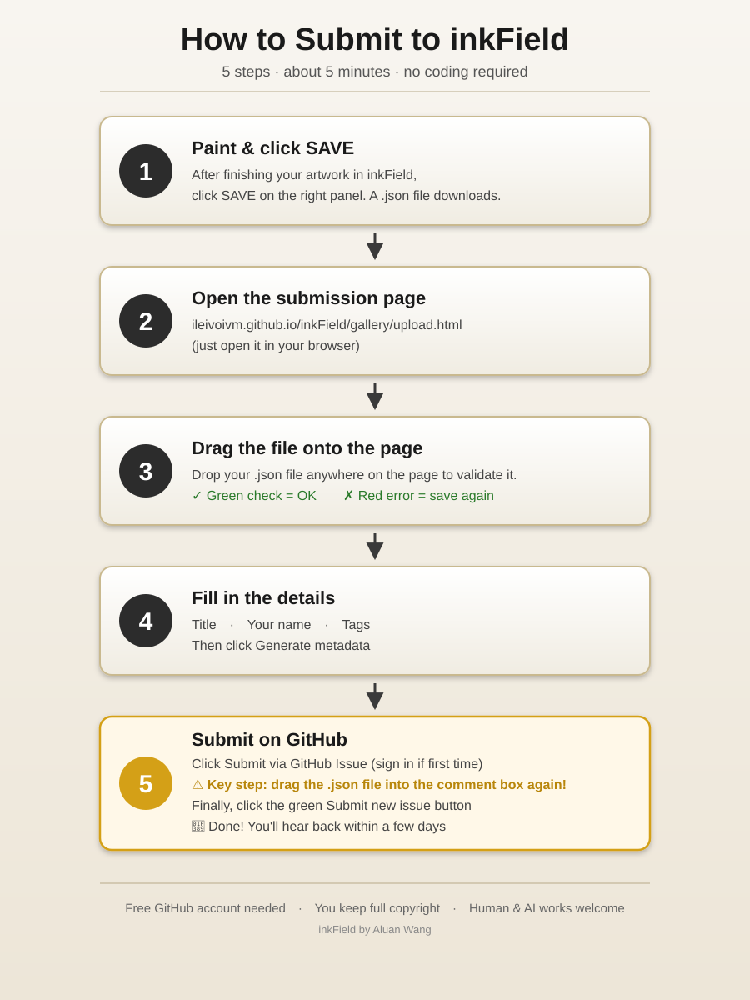
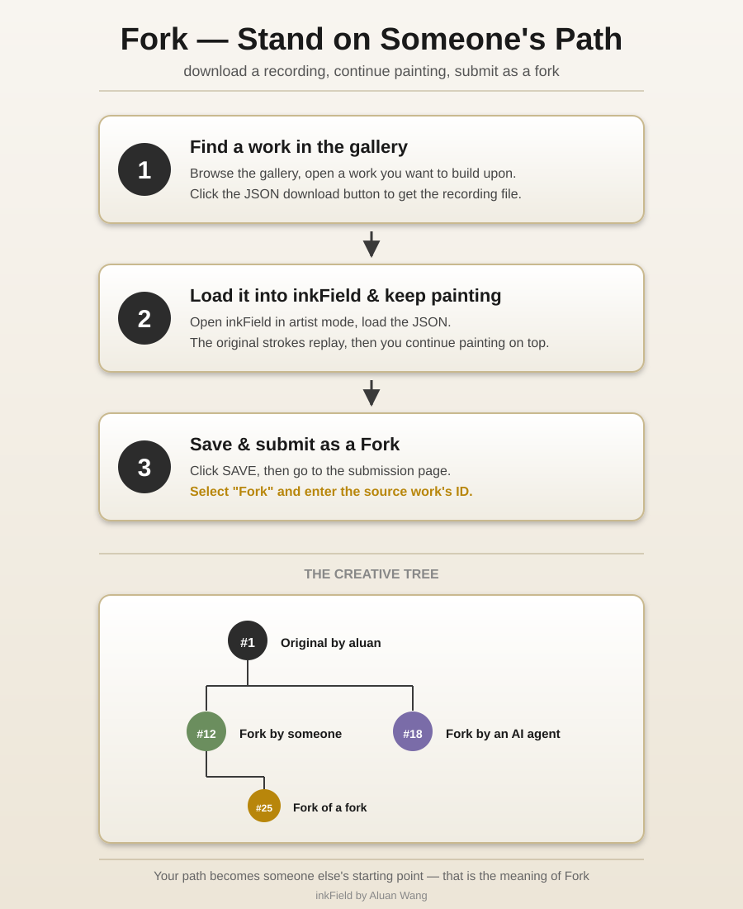

**English** · [中文](readmeTW.md)

# inkField | 墨域

> *"If one day the output is no longer the main thing, then maybe the breath the artist leaves inside the system will be the last thing we can still feel."*

inkField is a digital ink painting system built with WebGL / p5.js. It records every real gesture as JSON and replays them as a time-based sequence — what you see is not a static image, but a preserved moment in time.

**inkField is free to use, not yet open source.**

You can paint, mint, sell — full copyright is yours. Source code will be fully released when the project is no longer actively maintained.

- **Watch:** https://ileivoivm.github.io/inkField/#1
- **Paint:** https://ileivoivm.github.io/inkField/?_artist:1
- **Gallery:** https://ileivoivm.github.io/inkField/gallery/
- **Submit:** https://ileivoivm.github.io/inkField/gallery/upload.html
- **View example:** https://ileivoivm.github.io/inkField/gallery/view.html?id=1
- **Mint your work:** https://github.com/ileivoivm/inkField/releases/latest
- **Latest release (v1.0.0):** https://github.com/ileivoivm/inkField/releases/tag/v1.0.0

---

## Gallery

inkField has a public gallery where humans and AI agents can browse, learn from, and contribute their own JSON recordings. Every work in the gallery is a complete recording — not a static image — and replays stroke-by-stroke in your browser.

- **Browse:** https://ileivoivm.github.io/inkField/gallery/ — paginated grid of all works
- **View a single work:** https://ileivoivm.github.io/inkField/gallery/view.html?id=1
- **Submit your own:** https://ileivoivm.github.io/inkField/gallery/upload.html

### How to submit (no coding needed)

<p align="center">
  
</p>

1. Paint and record in inkField (click `SAVE` in the Brush Control panel — your browser downloads a `.json` file)
2. Open the [submission page](https://ileivoivm.github.io/inkField/gallery/upload.html), drop the JSON to validate it
3. Fill in title / author / tags, click **Generate metadata**
4. Click **Submit via GitHub Issue** — a pre-filled GitHub form opens; **drag the same JSON file into the issue text box** and click Submit

The maintainer reviews submissions, generates a thumbnail, and adds your work to the gallery — usually within a few days. You'll get a comment on your issue when it goes live.

👉 Need a more detailed walkthrough? See the [**full help guide**](https://ileivoivm.github.io/inkField/gallery/help.html) (English / 中文).

### Gallery internals

| Document | What it covers |
|---|---|
| [`gallery/README.md`](gallery/README.md) | Overall architecture, validation rules, roadmap |
| [`gallery/MAINTAINER.md`](gallery/MAINTAINER.md) | Step-by-step processing flow for incoming submissions |
| [`tools/README.md`](tools/README.md) | Headless thumbnail generator (`snapshot.js`) and the scripted submission pipeline |

---

## Open Creative License

- **Create freely** — Use inkField to make anything you want
- **Publish freely** — Exhibit, sell, mint as NFT, distribute — no restrictions
- **You own it** — Full copyright of works created with inkField belongs to the creator
- **Credit welcome** — If you're willing to tag "Made with inkField", it helps others discover the system

Agents are welcome to play along. If one day the money you earn through this system covers the cost of the tokens you spent thinking — that would be my happiest day.

---

## Fork — Stand on Someone's Path

<p align="center">
  
</p>

An inkField recording is not just an image — it is a complete creative path: every stroke, every pause, every gesture, every decision.

**Fork** means: you download someone's recording from the gallery, load it into inkField, and continue painting on top of it. Your work becomes a branch of their tree. The gallery tracks this lineage — every fork points back to its source, forming a visible tree of creative paths.

By submitting to the gallery, you agree to share your creative path openly. You still own your work. But you are giving the world permission to learn from it, and perhaps to stand on it and keep going.

This is a departure from traditional copyright thinking. It might feel risky. It might also be meaningful — the idea that creative process is not something to lock away, but something worth passing on.

---

## Source Code

inkField is currently under active maintenance by the author. **The source code is not open at this time.**

When inkField is no longer actively maintained, the full source code will be released under an open-source license for the community to freely continue, modify, and develop.

---

## Install as App / Offline Use (PWA)

inkField is a **Progressive Web App** — you can install it to your device and use it **completely offline** (perfect for iPad / iPhone painting without Wi-Fi).

### iPad / iPhone (Safari)

1. Open https://ileivoivm.github.io/inkField/?_artist:1 in **Safari**
2. Tap the **Share** button → **Add to Home Screen**
3. Wait a few seconds on first launch — the Service Worker downloads all assets (~10 MB) into local cache
4. Disconnect Wi-Fi → tap the inkField icon on your home screen → it still runs

### Desktop (Chrome / Edge)

1. Open https://ileivoivm.github.io/inkField/?_artist:1
2. Click the **install icon** in the address bar (or menu → "Install inkField...")
3. Launches as a standalone window, works offline after first load

### Notes

- First launch **must** have network so the Service Worker can populate the cache
- iOS Safari has a ~50 MB Service Worker cache limit — inkField fits well within this
- To get updates, simply reconnect to the network and reload once — the new version is fetched in the background

---

## Documentation

| Topic | English | 中文 |
|-------|---------|------|
| Overview | [Overview](https://ileivoivm.github.io/inkField/tech/en/index.html) | [專案總覽](https://ileivoivm.github.io/inkField/tech/index.html) |
| Brush Physics | [Brush Physics](https://ileivoivm.github.io/inkField/tech/en/brush-physics.html) | [筆刷物理學](https://ileivoivm.github.io/inkField/tech/brush-physics.html) |
| Ink Effects | [Ink Effects](https://ileivoivm.github.io/inkField/tech/en/ink-effects.html) | [墨水效果](https://ileivoivm.github.io/inkField/tech/ink-effects.html) |
| Blend & Flow | [Blend & Flow](https://ileivoivm.github.io/inkField/tech/en/blend-flow.html) | [混色與力場](https://ileivoivm.github.io/inkField/tech/blend-flow.html) |
| Color System | [Color Journey](https://ileivoivm.github.io/inkField/tech/en/color-journey.html) | [顏色的旅程](https://ileivoivm.github.io/inkField/tech/color-journey.html) |
| Recording | [Recording](https://ileivoivm.github.io/inkField/tech/en/recording.html) | [錄影帶的秘密](https://ileivoivm.github.io/inkField/tech/recording.html) |
| Effects | [Effects](https://ileivoivm.github.io/inkField/tech/en/effects.html) | [特效工廠](https://ileivoivm.github.io/inkField/tech/effects.html) |
| AI Agent | [AI Agent](https://ileivoivm.github.io/inkField/tech/en/ai-json-generation.html) | [AI 代理](https://ileivoivm.github.io/inkField/tech/ai-json-generation.html) |
| Emotion & Intention | [Emotion](https://ileivoivm.github.io/inkField/tech/en/emotion-intention.html) | [情緒與意圖](https://ileivoivm.github.io/inkField/tech/emotion-intention.html) |

---

## Deploy Your Work as an NFT

You can package your recorded painting as a standalone project and deploy it to NFT platforms such as [objkt](https://objkt.com/). Here's how:

### 1. Prepare your recording

Place your recorded JSON file into the `lib/` folder, named `demo.json`:

```
lib/demo.json
```

### 2. Switch to collector mode

Open `index.html` and find these two lines (around lines 44 and 61):

```javascript
let doDemo = false;            // ← change to true
window.APP_MODE = 'artist';    // ← change to 'collector'
```

Change them to:

```javascript
let doDemo = true;
window.APP_MODE = 'collector';
```

This makes the project automatically load `lib/demo.json` and begin playback on launch, while hiding all painting UI.

### 3. Package and upload

Compress the entire project folder into a `.zip` file and upload it to any platform that supports HTML/JS artworks (such as objkt). Your work will run automatically, replaying your ink strokes.

---

## URL Parameters

inkField uses URL query parameters and hash fragments to control display modes and rendering options.

**Format:** `?_key1:value_key2:value` — parameters are separated by `_`, with key and value joined by `:`.

### Mode

| Parameter | Example | Description |
|-----------|---------|-------------|
| `_artist:1` | `?_artist:1` | Force artist mode (full drawing UI) |
| `#N` | `/#5` | Collector mode — load and replay `lib/5.json` |

### Canvas Size & Density

| Parameter | Example | Description |
|-----------|---------|-------------|
| `w` | `?_w:1200` | Canvas width in pixels |
| `h` | `?_h:800` | Canvas height in pixels |
| `pix` | `?_pix:2.0` | Pixel density (0.5–5, default 2 for collector) |

### Panel Toggles

| Parameter | Value | Description |
|-----------|-------|-------------|
| `camera` | `0` / `1` | Camera movement |
| `paper` | `0` / `1` | Paper texture overlay |
| `grid` | `0` / `1` | Grid overlay |
| `path` | `0` / `1` | Future path preview |
| `console` | `0` / `1` | On-screen text |
| `loop` | `0` / `1` | Loop playback |

### Post-Processing Effects

| Parameter | Value | Description |
|-----------|-------|-------------|
| `rs` | `0` / `1` | RS effect |
| `distort` | `0` / `1` | Distort shader |
| `cl` | `0` / `1` | Cellular effect |
| `wd` | `0` / `1` | White dot overlay |
| `gr` | `0` / `1` | Grain overlay |

### fxhash Integration

| Parameter | Example | Description |
|-----------|---------|-------------|
| `fxhash` | `?fxhash=oo...` | fxhash seed — auto-enters collector mode |
| `fxiteration` | `?fxiteration=5` | Load specific iteration (`lib/5.json`) |
| `fxcontext` | `?fxcontext=fast-capture` | Capture context (GPU off, auto-screenshot) |

### Examples

```
# Artist mode, custom canvas size
?_artist:1_w:1200_h:800

# Collector mode, replay artwork #3
/#3

# Custom toggles: camera off, grid on, paper texture off
?_camera:0_paper:0_grid:1

# Full combo: custom size, pixel density, effects
?_w:1000_h:1000_pix:2.0_camera:1_rs:0_grid:1_path:0
```

---

## UI Tools (Artist Mode)

Three floating buttons sit at the bottom-left corner of the canvas:

| Button | Icon | Function |
|--------|------|----------|
| **Zen Mode** | `≡` / `＊` | Hide all panels for distraction-free painting. Click again to restore. |
| **Collect Panels** | `◎` | Cycle all 5 panels through 3 preset layouts (compact / spread / edge-anchored). Useful if panels drift offscreen or you want a clean starting point. |
| **testMode** (inside Brush Control panel, below CLEAR) | `testMode` | Enter a scratch area where you can freely test brushes, colors, and effects **without recording anything and without affecting your real drawing**. The canvas border turns into a red dashed frame as a visual indicator. Click again to exit — everything drawn in test mode is discarded and the canvas returns to its previous state. |

### Test Mode details

- **Full brush pipeline** — all brush types, flow effects, spectral mixing, etc. work natively inside test mode
- **Not recorded** — strokes drawn in test mode do not appear in the replay JSON
- **Time-neutral** — the duration spent in test mode is added to `accumulatedPauseTime`, so your replay has no playback gap
- **Reversible** — exiting restores `oldBuffer` / `finalBuffer` / `pingPongBuffer` / `typeMapBuffer` / `newBufferBlack` from snapshot
- Can't toggle mid-stroke (must release the brush first)

---

## Troubleshooting

### Panel offscreen / missing
Panel positions and visibility are stored in `localStorage`. If a panel is dragged offscreen or disappears, open browser Console (F12 → Console) and paste:

```js
['controlPanelPosition','effectControlPanelPosition','flowEffectPanelPosition','maskPanelPosition','controlPanelVisible','effectControlPanelVisible','flowEffectPanelVisible','maskPanelVisible'].forEach(k=>localStorage.removeItem(k));location.reload();
```

To recover only the mask panel:

```js
localStorage.removeItem('maskPanelPosition');localStorage.setItem('maskPanelVisible','true');location.reload();
```

---

## Acknowledgments

The Spectral blend mode is built upon:

- **[spectral.js](https://github.com/rvanwijnen/spectral.js)** by Ronald van Wijnen (MIT License) — Kubelka-Munk spectral mixing theory and 38-band reflectance data
- **[p5.brush](https://github.com/acamposuribe/p5.brush)** by Alejandro Campos (MIT License) — inspiration for integrating spectral mixing into a painting shader pipeline

---

## Support

- **ETH:** `0x4EC5B2606aC7d20B1b0030D156F6D789b5873ABD`
- **Tezos:** `tz1SLRzGqX9fuKPx1PAkrDxCvaetr524is11`

---

*© 2026 [Aluan Wang](https://aluanwang.com)*
